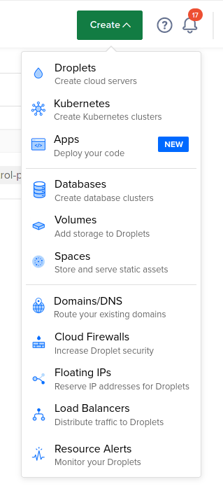

In this lesson, we will create a _Droplet_ (server) on DigitalOcean. After creating the droplet, we'll learn how to access it from your local machine.

---

To get started with self-hosting, you'll need a _server_ to run the applications. There are multiple options on how you can host a server:

- Cloud-based providers like AWS, DigitalOcean etc.
- Raspberry Pi
- Network Attached Storage (NAS) devices like Synology etc.

Some of these options require you to purchase hardware and manage them completely by yourself. However if you don't want to make the upfront commitment of a hardware purchase as well as take over the responsibility of maintaining it, cloud-based providers are an excellent choice for the majority of people.

There are various options that you can explore while choosing a provider. The things to keep in mind generally are:

- **Cost**: You don't want to overpay for a similar hardware spec that you can get with other providers.
- **Latency**: If all your usage is predominantly going to be from within your home country, then it makes sense to choose a _Region_ close to your home country.
- **Security**: The cloud provider you choose should have a competent track record of being secure and have fine-grained access controls on every resource you create.

To keep things consistent across cohorts of students at Mon School, we will be using **DigitalOcean** as our cloud provider for the course. The course content will be tailored with the context that you're running a DigitalOcean VPS (also called as _droplet_).

## Step 1: Create a new account at DigitalOcean

To create a Droplet, you'll need to signup for a DigitalOcean account. Head over to [DigitalOcean](https://www.digitalocean.com/) website and signup with your email/password. You'll need to enter your Credit Card details but you'll only be charged at the end of the billing cycle (monthly) for the resources you have created.

## Step 2: Create a new Droplet

Let's create a new droplet by visiting "Droplets" in the sidebar.



A form will pop up asking you to enter some configuration details for the droplet. For this course, the following config should be enough:

- **Image**: Ubuntu 20.04 LTS (x64)
- **CPU Plan**: Basic (Shared CPU)
- **CPU Options**: Regular Intel with SSD ($5/mo plan)
- **Datacenter Region**: Pick the one closest to where you live. If you're from India you can choose _Bangalore_.
- **Additional Options**: `Monitoring`
- **Authentication**: Select `Password` for now. We will change to `SSH-based as we progress in the course.
- **Hostname**: `playground`. Feel free to get creative and name it whatever you like!
- **Project**: `Monschool`

Here's how it should look once you enter all the details:


Once you verify the details are correct, click on **Create Project** and wait for a minute or so for the droplet creation to happen. You will be able to access it soon after.

## Step 3: Log in to the droplet

### Using your local machine

Visit the [Droplets](https://cloud.digitalocean.com/droplets?i=a49aab) page and you'll find the droplet that you just created. Copy the _IP Address_ of your droplet and use that to log in as shown in the command below:

_NOTE_: Run this command on your local machine. You'll be prompted for a password and after that, you'll be able to log in to the server.

```
$ ssh root@1.2.3.4
root@1.2.3.4's password:
root@playground:~#
```

**NOTE**: If you're doing this course on a Windows machine, you can follow [this tutorial](https://docs.digitalocean.com/products/droplets/how-to/connect-with-ssh/putty/) and use PuTTY instead of `ssh`.

## Install Monschool Agent

Monschool Self Hosting Course aims to be practical and give a more hands-on experience for the students taking this course. There's a `monschool-agent` program that can be installed from [fossunited/monschool-agent/](https://github.com/fossunited/monschool-agent/). This agent is a diagnostic agent that helps mentors troubleshoot any errors faced by you while doing the lessons.

You can follow the [installation instructions](https://github.com/fossunited/monschool-agent/#install) and set it up before the next lesson.

---

Congrats! Give yourself a pat on the back. You've registered with a cloud provider, created a new droplet and learnt how to access it!

In the upcoming lesson, we'll learn how to create additional users to access the server.

| Task     |      Status      |
|----------|:-------------:|
| Create Droplet |  Pending      |
| Access Droplet |    Pending   |
| Install `monschool-agent` | Pending |
