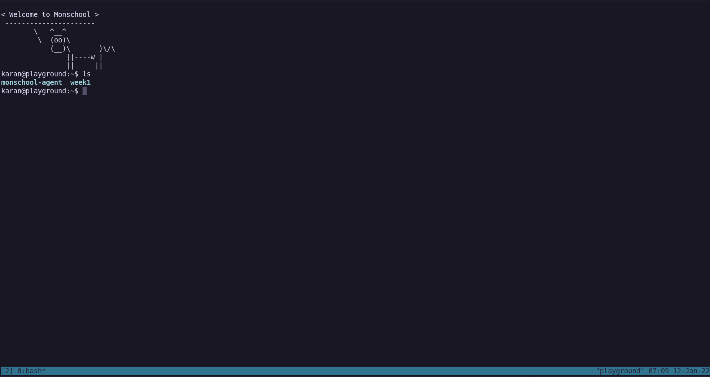

`tmux` is a terminal multiplexer, which allows you to create and persist "shell sessions" on the server. This is helpful if you have to run a long running command and don't want the process to be killed if your SSH connection is abrupted for any reason. This is also helpful if you have more than 1 person logging in to your server and you together need to work on the same session.

`tmux` allows you to _attach_ multiple shells to a same terminal session. That means, you can open a `tmux` window, split into multiple parts (_panes_) and run different commands on each of them.

Our task for this lesson is to run a command `cowsay "See you later"; sleep 60`. This command prints the message on terminal but takes 60 seconds to complete.

Let's create a new session with:

```
tmux
```



You'll be logged into to your current user account. `tmux` is controlled using what is called as **Modifier Key** (Mod). The default hotkey for that is `Ctrl+b`. This combination will be referred as `mod` from now onwards.

### Running Commands

Let's run our command `cowsay "See you later"; sleep 60`. You'll notice the output gets printed immediately to the terminal but the prompt will be returned only after 60s.

```
❯ cowsay "See you later"; sleep 60
< See you later >
 ---------------
        \   ^__^
         \  (oo)\_______
            (__)\       )\/\
                ||----w |
                ||     ||
```

Since we don't want to wait for a minute, we can just _deattach_ from this session and return to our normal prompt. To do that, you'll need to use `mod d`. Once you press that, you'll be returned back to the prompt from where you started the `tmux` session.

Here you can even list active sessions with:

```
tmux ls
0: 1 windows (created Tue Dec 14 18:19:10 2021)
```

To attach to the session we just created:

```
tmux a -t 0
```

Congrats! You completed the task for this lesson. We used `tmux` to run a long running command and learnt how to attach/deattach sessions.

## Additional Shortcuts

### Panes

- `mod %`: To split a window vertically.
- `mod "`: To split a window horizontally.
- `mod [`: To add a scrollbar to current pane.

You can move around the panes with `mod + Right/Left/Up/Down` arrow keys.

### Windows

- `mod c`: Create a new window.
- `mod p`: Switch to previous window index.
- `mod n`: Switch to next window index.

You can explore some handy cheatsheets like https://tmuxcheatsheet.com/ and https://devhints.io/tmux for more commands.
