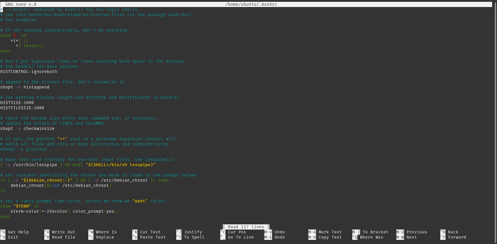

One of the most fundamental tasks that one should know inside servers is being able to manage files and directories. Quite often you'll need to edit a config file, a cronjob, a service unit file and all of these tasks require that you understand how to edit files in a non GUI environment.

To learn how to navigate your way around the filesystem, there are a few commands that you should know about. However, instead of learning these commands all at once, let's think about a real world scenario where you will need to make use of these commands.

We'd used `fortune` in our previous lesson where we learnt how to use `fortune` to print a random fortune cookie on the terminal. Our task for this lesson would be to print a new fortune cookie everytime you login to the server. To achieve that, we will need to edit a config file (`~/.bashrc/`) and make some changes.

Let's do this step by step!

Before we begin editing `~/.bashrc` (don't worry, we'll get on to what `~` actually means), we should first know where we are. Our first command in our toolset is `pwd`:

### `pwd`: _Print Working Directory_

This command simply tells which _directory_ you are are currently in the filesystem.

```
$ pwd
/home/ubuntu
```

As shown in the above output, we are inside `/home/ubuntu` directory. This directory is also called as `HOME` directory. Many shells expand the character `~` to the full `/home/ubuntu` path, so you can also use `~` as an alias if you don't want to type the full path of the `HOME` directory. Each user gets their own `HOME` directory and if you want to find the `HOME` directory for a particular user programatically, you can also read the environment variable `$HOME` which also points to `/home/ubuntu`.

Now we know that we are inside `/home/ubuntu`, and we need to edit `~/.bashrc` file, how to we do that? We'll need to use a text editor to open this file and save our changes. To keep things simple and easier for beginners, we'll use `nano`. If you know `vim`/`emacs` already you can of-course choose your own poison, but for most people doing this course, `nano` is an excellent choice.

Let's open the file:

`nano ~/.bashrc`

An editor opens in which you can see the contents of `~/.bashrc`.



We need to scroll to the bottom, so keep hitting `down` arrow key or `Pg Down` and scroll to the end of the file.

Next, copy paste this exact snippet:

```bash
if [ -x /usr/games/cowsay -a -x /usr/games/fortune ]; then
    fortune | cowsay
fi
```

Next, we need to save the file with the changes we made. Hit `Ctrl+X` and you'll be prompted for confirmation. Hit `Y` (_Yes_) to confirm that you want to save these changes.

You can see the contents of the file you just saved using `cat`:

```bash
cat ~/.bashrc
```

To see a new fortune cookie, simply logout and login the server. You'll be greeted with a message like this:

```
 ______________________________________
/ A few hours grace before the madness \
\ begins again.                        /
 --------------------------------------
        \   ^__^
         \  (oo)\_______
            (__)\       )\/\
                ||----w |
                ||     ||
ubuntu@playground:~$ 
```

### Additional Resources

We've barely scratched the surface of the commands that will help you managing files/directories.

You are encourage to read `man` pages of these commands. [Manual pages](https://man7.org/linux/man-pages/) help to understand what each command does and what are the additional options (_flags_) you can pass to achieve your desired results.

To read man page of `ls`, for example, simply enter and a manual doc will open in your terminal:

```
man ls
```

There are some useful resources like https://tldr.sh/ and https://explainshell.com/ which can help you not feel overwhelmed with too much of docs suddenly and find out the flag/information about each command quickly.
