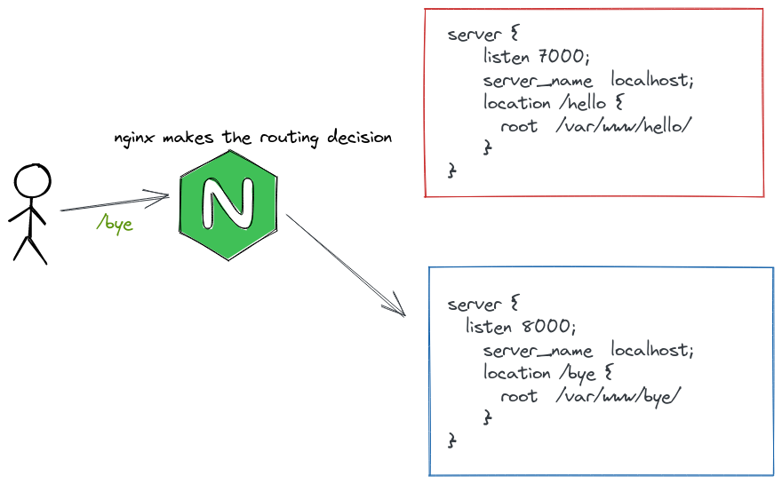
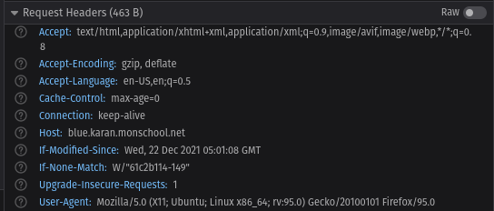
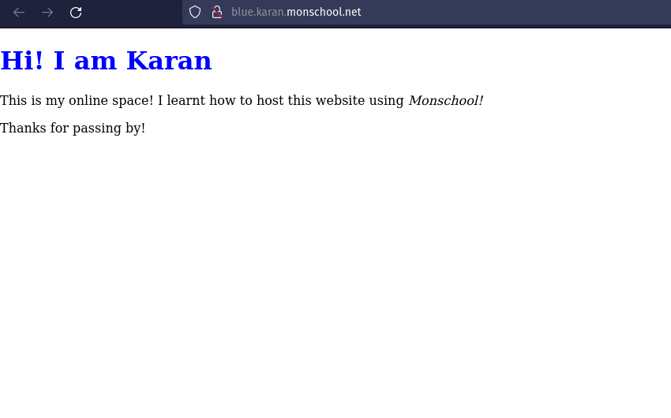

In the previous lesson we learnt how to modify the existing _Welcome_ HTML page in NGINX. The _Welcome_ page is good to explore around the basics of NGINX and tweak it. However if you want to setup a website you will need to learn about _Server Blocks_.

## What's a Server Block?

A server block is a self contained _block_ to represent the configuration details of a _domain_. A domain for a site can be the root domain, sub domain or a wildcard domain as well. Here's how a server block looks:

```
http {

  server {
    server_name www.site1.com;
    root /var/www/site1.com;
  }

  server {
    server_name www.site2.com;
    root /var/www/site2.com;
  }
}
```

### How a request is routed

The directive `server_name` is used to represent each unique _server block_. NGINX makes decision on how to route the client's request based on the directives present inside each server block. It's possible to have the same `server_name` across multiple server blocks but different directives inside each (such as `listen` which specifies which _port_ to listen on). Here's an example of 2 server blocks listening on different ports:

```
http {
  server {
      listen 7000;
      server_name  localhost;
      location /hello {
        root  /var/www/hello/
      }
  }

  server {
    listen 8000;
      server_name  localhost;
      location /bye {
        root  /var/www/bye/
      }
  }
}
```



With the above configuration block, NGINX will route the requests on `/bye` to the second server block which is listening on port `8000`.

## Create a new site

In this lesson, we want to setup our own minimal _Hello World_ webpage. We want the webpage to be available at `blue.<user>.monschool.net`. Here `user` represents your unique username that you used while registering for Mon School.

Let's first create the directory where we'll store assets for our website. You can replace `karan` with your own username in the following command:

```bash
sudo mkdir /var/www/blue.karan.monschool.net
cd /var/www/blue.karan.monschool.net
```

We need to have a simple HTML page for our website. If you know HTML already, feel free to design a welcome page the way you like. For others, worry not you can copy paste the following snippet and make some design changes if you feel like:

```
sudo nano index.html
```

```html
<!DOCTYPE html>
<html>
<head>
<title>Welcome to Monschool!</title>
<style>
    body {
        margin: 0 auto;
    }
    h1 {
        color: blue;
    }
</style>
</head>
<body>
<h1>Hi! I am Karan</h1>
<p>This is my online space! I learnt how to host this website using <i>Monschool!</i></p>
<p>Thanks for passing by!</p>
</body>
</html>                                                                                                                                                            
```

Once you've saved the file as `index.html`, we need to configure NGINX to add a new _server block_ for our website. If you recall the previous lesson about NGINX configuration layout, we'd talked about 2 different places where the configs are store. The default config exists inside `sites-enabled` directory. In this lesson, let's use the other directory `conf.d` to store our config:

```
$ cd /etc/nginx/conf.d
$ sudo vim blue.conf
```

**NOTE**: There's a special `include` directive inside `/etc/nginx.conf` which requires that all files under `conf.d` to end with `.conf`, hence we are naming our config for `blue.<user>.monschool.net` as `blue.conf`.

```
server {
    listen      80;
    server_name blue.karan.monschool.net;
    root                    /var/www/blue.karan.monschool.net;

    location / {
        try_files $uri $uri/ /index.html;
    }
}
```

### Explanation:

- **listen**: Specifies which port number to listen on.
- **server_name**: Specifies the hostname of our site. Whenever we visit a website from our browser, our browsers send _Headers_ in the request. These _Headers_ contain meta information about the request. One of the headers is called **Host** header. When we visit the URL `http://blue.karan.monschool.net`, the header is passed as `Host: blue.karan.monschool.net`. This information helps NGINX decide where to route the request to. Since we have a `server_name` that matches this Host header, the request comes inside this server block.



- **root**: Specifies the directory path where our files are present.
- **location**: You've seen websites have multiple paths like `/login`, `/logout` etc. If you want to have custom rules for each path, you can do that with a `location` directive.
- **try_files**: This directive tries to match the URI received in the request with a file inside our root directory. For example http://blue.karan.monschool.net/css/style.css will first try to match if `css/style.css` exists in our root directory. The second condition `$uri/` means that it'll try to check if `css/style.css` exists as a directory. The third condition is called a fallback condition, where if the first 2 preceding conditions failed, it will load `index.html` in the root directory.

After saving the file as `blue.conf`, let's reload our NGINX:

```
$ sudo nginx -t
nginx: the configuration file /etc/nginx/nginx.conf syntax is ok
nginx: configuration file /etc/nginx/nginx.conf test is successful

$ sudo nginx -s reload
```

Let's visit the browser and type the URL http://blue.<user>.monschool.net/ in the address bar:




todo: add conf.d note
todo: remove location/
todo: remove host header explanation