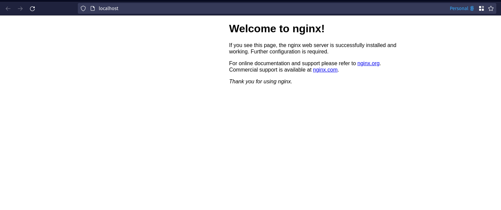

## What is NGINX

NGINX is a popular web server which is used to serve static assets (such as HTML files, Cascading Style Sheets, JS bundles). It's also used as for load balancing requests across multiple servers, caching assets etc. NGINX is also a highly concurrent web server allowing you to serve several thousands of connections with a low CPU/Memory footprint.

### Why is NGINX needed? 

Imagine you have created a small website for yourself but you want the world to see it. How do you do that? You need a way to _serve_ these assets via a webserver. There are several advantages that you get via using NGINX or a similar proxy in front of your application:

- **Compression**: You can configure NGINX to compress the static assets which means the browsers are able to fetch assets _faster_ as the size of responses reduces.
- **Load Balancing**: If your application is distributed, you want to load balance user requests to different servers. With NGINX, you can configure it to loadbalance these requests across multiple servers so the load is equally distributed.
- **SSL Encryption**: NGINX sits in front of your applications and can be configured to decrypt client's requests and encrypt outgoing responses. This allows you to not reinvent the wheel of terminating SSL in every application.
- **Persistent Connections**: Opening and closing connections is a computationally expensive task that requires additional CPU overhead adding to increased request latency. When you have several thousands of users using your website, you need a way to handle all these requests efficiently. NGINX multiplexes these thousands of connections in a small number of connections and forwards them to your application. This is critical in ensuring that your application doesn't get flooded with so many requests at once and help in efficient resource management. 

These are some of the many advantages that NGINX has to offer. Let's first install it on our server and get some real hands on experience with it.

## Installing

If you recall Week-1, we discussed how to install software packages using `apt`. Let's install `nginx` using the same steps:

```
sudo apt-get update
sudo apt-get install nginx
```

We've installed `nginx` and you can see the version of `nginx` installed using:

```bash
$ nginx -v                
nginx version: nginx/1.18.0 (Ubuntu)
```

When we install `nginx`, the package manager (`apt`) also sets up `nginx` as a system service and starts it automatically. We can view the status of this services using the command `systemctl`:

```bash
$ sudo systemctl status nginx             
● nginx.service - A high performance web server and a reverse proxy server
     Loaded: loaded (/lib/systemd/system/nginx.service; enabled; vendor preset: enabled)
     Active: active (running) since Tue 2021-12-21 22:46:38 IST; 47s ago
       Docs: man:nginx(8)
    Process: 206739 ExecStartPre=/usr/sbin/nginx -t -q -g daemon on; master_process on; (code=exited, status=0/SUCCESS)
    Process: 206740 ExecStart=/usr/sbin/nginx -g daemon on; master_process on; (code=exited, status=0/SUCCESS)
   Main PID: 206841 (nginx)
      Tasks: 9 (limit: 18886)
     Memory: 8.1M
        CPU: 67ms
     CGroup: /system.slice/nginx.service
             ├─206841 nginx: master process /usr/sbin/nginx -g daemon on; master_process on;
             ├─206843 nginx: worker process
             ├─206844 nginx: worker process
             ├─206845 nginx: worker process
             ├─206846 nginx: worker process
             ├─206847 nginx: worker process
             ├─206848 nginx: worker process
             ├─206849 nginx: worker process
             └─206850 nginx: worker process

Dec 21 22:46:38 pop-os systemd[1]: Starting A high performance web server and a reverse proxy server...
Dec 21 22:46:38 pop-os systemd[1]: Started A high performance web server and a reverse proxy server.
```

You'll see an output similar to the above. As the output mentions the service is **Active**, `nginx` process is running in background. Now you must be wondering that if `nginx` is already running, is there a way we can interact with it already? The answer is _Yes!_. `nginx` comes with a default website that shows a _Welcome_ page.

You can visit the address `localhost` in your browser and see this page:



Super! Now that `nginx` is up and running, we'll learn how to modify the default page and setup our own web page in the future lessons.
